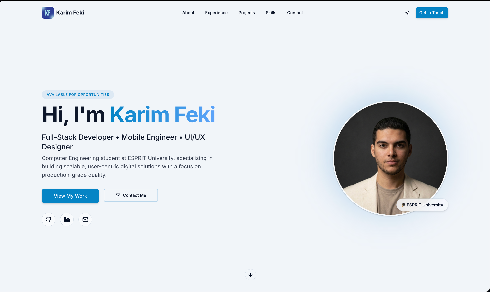
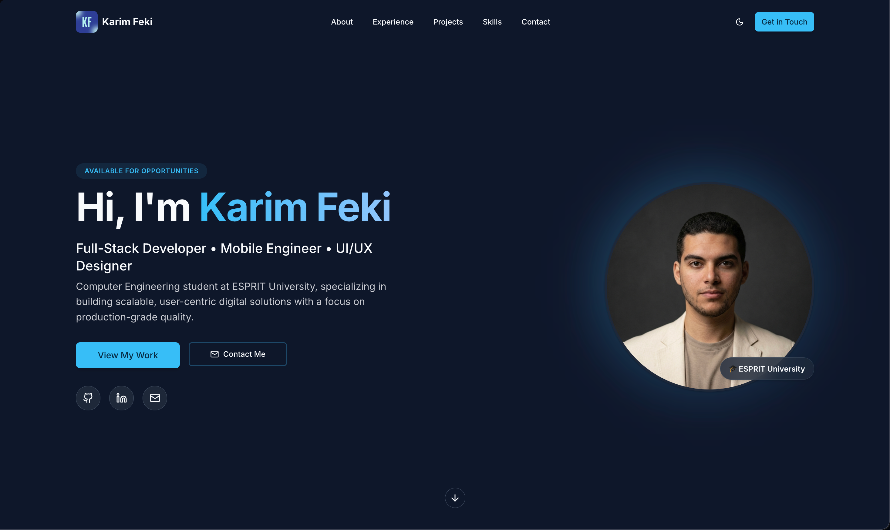

# Karim Feki Portfolio

<p align="center">
	
	
	
	
	
</p>

<p align="center">
	<a href="https://karimfeki.is-a.dev" target="_blank" rel="noreferrer">Live Site</a>
	·
	<a href="https://www.linkedin.com/in/karimfeki/" target="_blank" rel="noreferrer">LinkedIn</a>
	·
	<a href="https://github.com/fekikarim/" target="_blank" rel="noreferrer">GitHub</a>
	·
	<a href="mailto:feki.karim28@gmail.com">Email</a>
</p>

A modern, product-ready personal portfolio built with Vite, React, and TypeScript. Designed for clarity and polish, with a component-driven architecture, smooth motion, and a refined UI system.

## Table of contents

- Overview
- Demos
- Features
- Tech stack
- Getting started
- Scripts
- Project structure
- Customization
- Deployment
- Accessibility
- Testing
- Contact
- License

## Overview

This portfolio is a single-page experience highlighting identity, experience, projects, and contact details. It is designed to be fast, accessible, and easy to customize for new content or branding.

## Demos

Preview the current production look and feel. Images are served from `public/demo`.

| Theme | Preview |
| --- | --- |
| Light |  |
| Dark |  |

## Features

- Single-page flow with hero, about, experience, projects, skills, and contact
- Theme-aware UI with light and dark modes
- Smooth motion via scroll reveal and hover-lift interactions
- Reusable section and layout primitives for fast iteration
- Strong typing with TypeScript and modern linting

## Tech stack

- Framework: React 18
- Build tooling: Vite 5
- Language: TypeScript
- Styling: Tailwind CSS + tailwindcss-animate
- UI: shadcn/ui + Radix UI + lucide-react
- Routing: react-router-dom
- Testing: Vitest + Testing Library

## Getting started

### Prerequisites

- Node.js (LTS recommended)

### Install

```bash
npm install
```

### Run locally

```bash
npm run dev
```

The dev server runs on port 8080.

## Scripts

```bash
npm run dev        # Start dev server
npm run build      # Production build
npm run preview    # Preview production build
npm run lint       # ESLint
npm run test       # Vitest (CI-style)
npm run test:watch # Vitest in watch mode
```

## Project structure

- `src/pages/Index.tsx` - main page composition
- `src/components/sections/*` - page sections
- `src/components/layout/*` - layout primitives
- `src/components/ui/*` - shared UI components
- `src/lib/utils.ts` - shared utilities

## Customization

- Update content in `src/components/sections/*`.
- Adjust the theme in `src/components/ThemeProvider.tsx`.
- Replace demo media under `public/demo` and update the table in this README.

## Deployment

Build the production bundle:

```bash
npm run build
```

Preview the production build locally:

```bash
npm run preview
```

Deploy the output in `dist` to any static hosting provider.

## Accessibility

- Semantic layout sections and consistent heading structure
- Keyboard-friendly focus styles and interactive components
- Color contrast designed for both light and dark themes

## Testing

Run unit and component tests:

```bash
npm run test
```

## Contact

- Website: https://karimfeki.is-a.dev
- LinkedIn: https://www.linkedin.com/in/karimfeki/
- GitHub: https://github.com/fekikarim/
- Email: feki.karim28@gmail.com

## License

This project is licensed under the MIT License. See [LICENSE](LICENSE).
